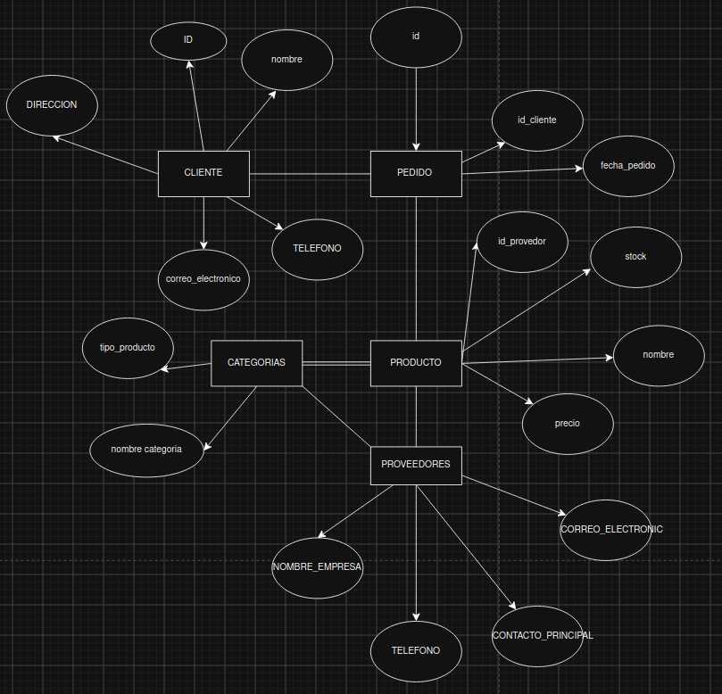

## Gestion de inventario para una tienda de tecnologia

Problema: 
La tienda TechZone es un negocio dedicado a la venta de productos tecnológicos, desde laptops y teléfonos hasta accesorios y componentes electrónicos. Con el crecimiento del comercio digital y la alta demanda de dispositivos electrónicos, la empresa ha notado la necesidad de mejorar la gestión de su inventario y ventas. Hasta ahora, han llevado el control de productos y transacciones en hojas de cálculo.

## la solucion

Se realizara una normalizacion hasta la 3ra forma para ver las entidades principales y de las cuales se insertaran datos y con esto se evitara los siguientes problemas:
Errores en el control de stock: No saben con certeza qué productos están por agotarse, lo que ha llevado a problemas de desabastecimiento o acumulación innecesaria de productos en bodega.

🔹 Dificultades en el seguimiento de ventas: No cuentan con un sistema eficiente para analizar qué productos se venden más, en qué períodos del año hay mayor demanda o quiénes son sus clientes más frecuentes.

🔹 Gestión manual de proveedores: Los pedidos a proveedores se han realizado sin un historial claro de compras y ventas, dificultando la negociación de mejores precios y la planificación del abastecimiento.

🔹 Falta de automatización en el registro de compras: Cada vez que un cliente realiza una compra, los empleados deben registrar manualmente los productos vendidos y actualizar el inventario, lo que consume tiempo y es propenso a errores.

Para solucionar estos problemas, TechZone ha decidido implementar una base de datos en PostgreSQL que le permita gestionar de manera eficiente su inventario, las ventas, los clientes y los proveedores.

ESto al implementarse se realizaran consultas para que el usuario pueda verificar.

## DIAGRAMA 
hasta la 3ra normalizacio.

## AUTOR:
Sergio Ricardo Ajù Miranda